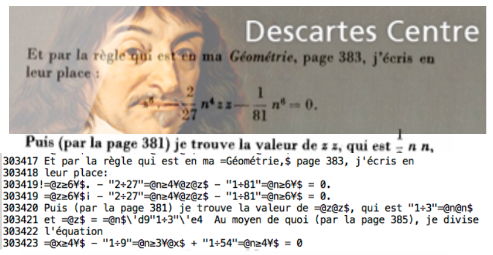
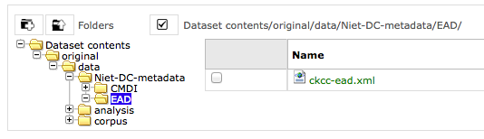

Convert.pl
==========
Description
-----------

Conversion development environment for converting the Descartes Corpus.

Source format
    the JapAM edition: plain unicode text with line numbers plus illustrations in gif.
Target format
    (pseudo) TEI, plus TeX-typeset formulas in gif, plus extra symbols in gif/png, plus same illustrations in gif.

It was a messy conversion, but we had a lot of fun doing it!

Authors 
-------
`Erik-Jan Bos <http://fr.linkedin.com/pub/erik-jan-bos/1b/b12/866>`_
    Expert on Descartes and his works.
    Found the source data, supplied additional metadata from his own database.
`Dirk Roorda <http://www.linkedin.com/in/dirkroorda>`_
    Expert in converting, wrote the conversion program.

Project
-------
`CKCC (Circulation of Knowledge ... Collaboratory of Correspondences) <http://www.huygens.knaw.nl/en/ckcc-%E2%80%9Cgeleerdenbrieven%E2%80%9D/>`_

The Descartes letters were part of this project, which also contains letters by
Hugo Grotius, Constantijn Huygens, Christiaan Huygens, Anthoni van Leeuwenhoek
and others.

The result of the project is the `ePistolarium <http://ckcc.huygens.knaw.nl/epistolarium/>`_ 
an online environment to do research on these letters.

The data has been archived at DANS, and will be Open Access available from Mid December 2013:
The archived CKCC dataset at DANS has the persistent identifier
`urn:nbn:nl:ui:13-scpm-ji <http://www.persistent-identifier.nl/?identifier=urn%3Anbn%3Anl%3Aui%3A13-scpm-ji>`_.

Timeframe of this conversion
----------------------------
2011, October-December
Current date: 2012-01-17
 
Provenance of the source data
-----------------------------
The source data (the file *JapAM.txt*) is a file created in 1998 by

* Katsuzo Murakami (University of Tokyo)
* Meguru Sasaki (École normale superieure d'Hokkaido)
* Takehumi Tokoro (University of Chyuo) 1998

This file is in a private ASCII encoding using characters 32-254, with identifier JAPAM.txt.

It was received on CD by Erik-Jan Bos and in 2011 converted by
* Erik-Jan Bos (then `Descartes Centre, University of Utrecht <http://www.descartescentre.com>`_)
* Dirk Roorda (`Data Archiving and Networked Services (DANS) <http://www.dans.knaw.nl/en>`_)

The conversion result (file *JapAM-EJB-DR.xml*) is XML-TEI.

The illustrations are taken from *Oeuvres de Descartes, 11 vols.,*,
editor: Charles Adam et Paul Tannery, Paris, Vrin, 1896-1911.

The complete metadata of the CKCC material can be found
in the `dataset at DANS <https://easy.dans.knaw.nl/ui/datasets/id/easy-dataset:55049/tab/2#>`_
(navigate to the file *ckcc-ead.xml* in the folder *original/data/Niet-DC-metadata/EAD*,
screenshot

).

About the sources and results
-----------------------------
The script takes as input most of the material in the data directory (and subdirectories) and nothing else.
The script produces its result files in subdirs of directory *results*:

texts:
    converted texts (end result and all intermediate stages)
messages:
    per conversion step:  information of what has been encountered, warnings, errors 
review:
    selected information extracted from inut and result, to be checked.
    Corrected version must be manually copied to the data directory in order to be included in a next conversion run.
formulas:
    gif or svg representation of all formulas that have been typeset with TeX during the conversion run
formulatex:
    contains a pdf with all formulas, on pages corresponding to the AM edition. For proofreading.

Installation Instructions
-------------------------
This is a nearly self contained Perl Script, it does not call other user-developed Perl modules.
It does call TeX and related programs, though.
It requires, however, some modules that might have to been added to the perl installation.

These are::
    Time
    Time::HiRes
    File::Path
    File::Copy.

The script calls programs from the TeXLive distribution. Make sure the following commands can be run from the command-line::

    tex
    xetex
    dvipng

If that is the case, this script will run without knowing where TeXLive is located.

Environment
-----------
This script presupposes an environment with a number of directories, filled with all kinds of material.
After unzipping the package of which this script is part, adjust the configuration section marked with::

    # o-o-o BEGIN CUSTOMISE o-o-o #

    my $rootdir = '/Users/dirk/Data/DANS/projects/CKCC/descartes';
    my $versiondir = '2012-01-17';

    #my $formulaformat = 'svg';
    my $formulaformat = 'gif';

    # o-o-o END   CUSTOMISE o-o-o #

to the local situation.

Usage
-----
Commmand forms::

    perl convert.pl
    ./convert.pl taskname1-taskname2

The first form does all tasks.

The second form does all tasks from ``taskname1`` til (including) ``taskname2``.

* If ``taskname1`` is omitted, start with the first task.
* If ``taskname2`` is omitted, continue till the last task.
* If the ``-`` is omitted and also one of ``taskname1`` or ``taskname2``, execute the specified task only

The script must be run from the commandline, positioned in the directory of this script.

Conversion steps
----------------
The full conversion is complex, because there are a lot of phenomena to deal with.
That is why the conversion has been split up in a sequence of conversion steps.
Each steps read as input the outcome of a previous step.
All intermediate results are written to disk, so the conversion steps can be checked thoroughly
and effectively.

Sometimes steps take other inputs as well, e.g. manually prepared instructions.
These instructions are sometimes based on the output of a previous step, and then
manually corrected by Erik-Jan.

Here is a list of the tasks::

    'escape',               # escape the italic markings and backslashes, because they will interfere with formulas
    'greek',                # greek character translation
    'trans',                # character codes translated to symbols
    'hyphen9',              # replace weird usage of 9 as hyphen by real hyphen
    'meta',                 # insert metadata per letter on the basis of EJB export
    'heads',                # insert headings per letter on the basis of EJB material
    'images',               # insert image links, based on EJB export
    'lines',                # remove line numbers, end-of-line hyphens, make paragraph structure
    'formit',               # formula symbols in italic scope
    'enmarge',              # handle marginal notes
    'openers',              # mark-up opening sections, based on heuristics
    'closers',              # mark-up closing sections, based on even more heuristics
    'pagenumbers',          # mark-up page breaks, special attention to in-word ones
    'ququ',                 # remove ?? markers
    'brackets',             # replace #( ... )# by ( ... )
    'abbrev',               # replace marked abbreviations ##xxx(.) by xxx.
    'formulas',             # translate formulas in the source into TEI/TeX
    'formset',              # translate tex formulas to individual gif or svg files
    'italic',               # translate remaining italic markers into TEI <hi rend="i">
    'atat',                 # remove @@ markers
    'superscript',          # translate remaining superscript markers into TEI <hi rend="sup">
    'marginals',            # translate marginal indicators into TEI <add place="margin>
    'headings',             # translate paragraphs starting with §xx§ to <hi rend="xxx">, also treat ±
    'tidyup',               # remove XML comments <!-- ... -->; other tidyings
    'checkxml',             # check the well-formedness of the individual letters

Source observations
-------------------
Here is an inventory of patterns and idiosyncrasies that we found in the source file plus
indactions how we treated those.

codes with #...#
^^^^^^^^^^^^^^^^
**Pattern => conversion step that deals with it => interpretation => result/action**::

    #astérisque3#       => do_trans         Three daggers                               => unicode string
    #cit ... #end       => do_trans         No visible meaning, occurs only once        => source adaption made
    #gre ... #end       => do_greek         Greek character runs                        => characters translated to Unicode
    #cos1#              => do_formulas      cossic symbol 1 (outside TeX)               => graphic cossic1.png
    #cos2#              => do_formulas      cossic symbol 2 (outside TeX)               => graphic cossic2.png
    #musique1#          => do_trans         Music: G-clef with bars                     => graphic musique.png inline
    #point#             => do_trans         A dot                                       => .
    #point25#           => do_trans         Linefill with dots                          =>   [...] (paragraph with 3 dots
    #infinitum#         => do_formulas      variant on equals sign                      => graphic propto.png = hor.flipped \propto, ∝
                                            occurs in TeX, cannot deal with that: split formula in three parts, so that #infinitum# outside TeX
    . (escaped as ¡)    => do_formulas      .                                           => .

NB: #infinitum# and = !!! I see that

*   where JapAM has =, the facsimile has the reversed \propto symbol (AM4L233F047)
*   where JapAM has #infinitum#, the facsimile has the || symbol 

NB: squares are coded as @x@x. I typeset them as x^{2}, controlled by the switch: detect_squares

**Other stuff**::

    a#¢t£#9il
    #chanut
    #dordrecht
    #fermat
    #mersenne
    #Pag.
    #sle>#

    ##cit
    ##pag

    <nt ...> <nt1 ...>  Marginal indicators. Some have been recoded as <mt A-Z> 
                        others have been transformed into normal text.
    <mt A-Z>            In fact a marginal note, coming from <nt(1)> by Erik-Jan and Dirk: <add place="margin">A-Z</margin>
    <g>                 gauche (left align, left column)
    <c>                 centre (mid align, mid column); 
    <d>                 droite (right align, right column);
    <d end>             has been removed

N.B. near <c> and <d> page numbers <m xxx> are repeated, I have removed it.

Formulas
^^^^^^^^
There are many formulas in the letters.
In order to translate them into TeX, we need to comprehend first the way they are coded in the source.
It was very hard to do that in one step, so we prepared the way by changing some symbols to others,
removing some ambiguities in the process.

**pattern interpretation**::

    " ... "             grouping
    ‚" ... ‚"           nested grouping
    \'d9 .... \'c4      squareroot
    \'d9 .... \'e4      also a squareroot, I think
    \'f9 .... \'e4      also a squareroot, I think
    \Ÿ .... \ƒ          sqareroot (genest)
    \" .... "           sqareroot (genest)
    \                   also a squareroot, but simple, only over next symbol(group)
    \C                  cubic root, only once!
    ÷                   in TeX: \over (much ado with braces), outside TeX: simply /
    /                   in TEI /, in TeX: \slash (a fraction of the form x / y without stacking)
    ≥ .... ¥            superscript
    º .... ¿            subscript
    +-                  plus of min ±
    |                   single bar in TeX: \vert
    ||                  double bar in TeX: \Vert
    ~                   hard space (tweaked into JapAM by Dirk and Erik-Jan
    @                   variable symbol: the next character is a letter to be interpreted as a variable in a formula
    &                   same as @, but the symbol should stay roman (added by Dirk, occurrences where it has been added automatically:
                            in every sequence of 2 or more capital roman vaiables, @ has been replaced by &
                            Erik-Jan has indicated more occurrences where @ should be replaced by &
    €                   same as @, but the symbol is explicitly italic (added by Dirk, occurrences where it has been added automatically:

    ♠                   displayed equation marker. If it occurs anywhere in a formula, it signals that the whole formula should be typeset
                            as a displayed equation (in the TeX sense). The symbol has no other function

Italics
^^^^^^^
I remove all italic scopes out of formulas, because what is italic and not is governed by rules.
* Formulas outside TeX: no italic.
* Formulas inside TeX: follow the TeX rules.

Corrections
^^^^^^^^^^^
In some cases there were obvious errors in the JapAM source.
We have commented out the offending line and put a corrected line in place.
See the lines starting with ``!`` (after the leading number) in the JapAM source.

Headings
^^^^^^^^
**space space** starts a paragraph, in JapAM. Sometimes we need to start a heading:

**space space §h4§ space** will start a heading. 

It will be translated to a normal ``
`` element, but with the text in a ``<hi rend="h4">`` subelement.
Any other text than h4 will translate into the value of the rend attribute.

**``
``** Sometimes a paragraph should be surrounded by a ``
 .. 
``.
That effect can be achieved by letting the paragraph start with **space space ±**

Metadata values
^^^^^^^^^^^^^^^
About the certainty of metadata values (sender, recipient, location, time).

Pattern => result::

    between [ and ]            : cert="high"
    between ( and )            : cert ="high"
    with ?                     : cert="low"
    combination of []/() and ? : cert="low"

    resp attribute: only resp="EJB"

``resp`` only occurs if we use metadata from Erik-Jan, and that occurs only in *senderloc* and *recipientloc*.

Formulas (revisited)
^^^^^^^^^^^^^^^^^^^^
When parsing formulas, we sprinkle new, fancy symbols in the formula material that help us to
chunk the formula in logical pieces, after which we can make the translation to TeX.
We use some pretty weird regular expressions underway, and here is a show case:

**identify formula candidates**::

    $n += $body =~ s/
    (
        (?:\A | [.,:;!?<>⊂⊃'\s]+)
        (?:
            (?: \b
                    (?: bis |
                        in  |
                        aequat
                    )
                (?!\p{Alpha})
                                        ) | # multiletter symbols
            (?: \#
                    (?: point |
                        infinitum |
                        cos1 |
                        cos2
                    )
                \#                      ) | # multiletter codes
            (?: \#gre
                    .*?
                \#end
                                        ) | # greek
            (?: □'[a-z][0-9]            ) | # special operators, such as sqrt
            (?: □[Ÿƒ]                   ) | # other special operators
            (?: □C?                     ) | # cubic-simple root symbol
            (?: [º¿]                    ) | # other special operators
            (?: [&€]\p{Alpha}           ) | # variables
            (?: [0-9]+                  ) | # digits
            (?: [~\s]+                  ) | # white space
            (?: [⌈⌉]                    ) | # italic markers
            (?: [^<>○⊂⊃\p{Alnum}]       )   # operators, brackets, relations, and whatever,
                                            #   NB ○○ (coming from @@) is not part of a formula
                                            #   NB ⊂ and ⊃ (coming from #< and >#) is not part of a formula
        ) {1,}
        (?: \z|[.,:;!?<>⊂⊃'\s+])
    )
    /analyseformulas($amid, $1)/sgex;

**getting the braces (grouping) right**::

    extra braces to constrain the scope of TeX's \over:  A + B/C + D => A + { B/C } + D

    $n = $newform =~ s/
        (
            (?:                                 # the piece before the division
                (?:                             #   either a subexpression enclosed in braces
                    【
                        [^÷【】]+               #       that does not contain other braces and divisions and extra braces
                    】
                ) |
                (?:                             #   either a subexpression enclosed in subbraces
                    〔
                        [^÷〔〕]+               #       that does not contain other braces and divisions and extra subbraces
                    〕
                ) |
                (?:                             #   either a subexpression enclosed in parentheses
                    \(
                        [^÷()]+                 #       that does not contain other braces and divisions and extra parentheses
                    \)
                ) |
                (?:                             #   either a subexpression enclosed in root braces
                    ⌊
                        [^÷⌊⌋]+                 #       that does not contain other braces and divisions and extra braces
                    ⌋
                ) |
                (?:                             #   either a subexpression enclosed in root braces
                    ◐
                        [^÷◐◑]+                 #       that does not contain other braces and divisions and extra braces
                    ◑
                ) |
                (?:                             #   either a subexpression enclosed in root braces
                    ◀
                        [^÷◀▶]+                 #       that does not contain other braces and divisions and extra braces
                    ▶
                ) |
                (?:                             #   either a subexpression enclosed in root braces
                    ◁
                        [^÷◁▷]+                 #       that does not contain other braces and divisions and extra braces
                    ▷
                ) |
                (?:                             #   either a subexpression enclosed in root braces
                    〈
                        [^÷〈〉]+               #       that does not contain other braces and divisions and extra braces
                    〉
                ) |
                (?:                             #   or an "atomic" subexpression (no braces, brackets, spaces, divisions
                    [^÷()【】〔〕⌊⌋◐◑◀▶◁▷〈〉\s~]+
                )
            )
        ) 
        (\s*÷\s*)                               # the division itself
        (
            (?:                                 # the piece after the division
                (?:                             #   either a subexpression enclosed in braces
                    【
                        [^÷【】]+               #       that does not contain other braces and divisions and extra braces
                    】
                ) |
                (?:                             #   either a subexpression enclosed in subbraces
                    〔
                        [^÷〔〕]+               #       that does not contain other braces and divisions and extra subbraces
                    〕
                ) |
                (?:                             #   either a subexpression enclosed in parentheses
                    \(
                        [^÷()]+                 #       that does not contain other braces and divisions and extra parentheses
                    \)
                ) |
                (?:                             #   either a subexpression enclosed in root braces
                    ⌊
                        [^÷⌊⌋]+                 #       that does not contain other braces and divisions and extra braces
                    ⌋
                ) |
                (?:                             #   either a subexpression enclosed in root braces
                    ◐
                        [^÷◐◑]+                 #       that does not contain other braces and divisions and extra braces
                    ◑
                ) |
                (?:                             #   either a subexpression enclosed in root braces
                    ◀
                        [^÷◀▶]+                 #       that does not contain other braces and divisions and extra braces
                    ▶
                ) |
                (?:                             #   either a subexpression enclosed in root braces
                    ◁
                        [^÷◁▷]+                 #       that does not contain other braces and divisions and extra braces
                    ▷
                ) |
                (?:                             #   either a subexpression enclosed in root braces
                    〈
                        [^÷〈〉]+               #       that does not contain other braces and divisions and extra braces
                    〉
                ) |
                (?:                             #   or an "atomic" subexpression (no braces, brackets, spaces, divisions
                    [^÷()【】〔〕⌊⌋◐◑◀▶◁▷〈〉\s~]+
                )
            ) 
        )
    /addbraces($1,$2,$3)/sxge;

**check whether all temporary symbols have been removed**::

    for my $symbol ([
            '【',
            '】',
            '〔',
            '〕',
            '⊂', 
            '⊃',
            '⌊',
            '⌋',
            '◀',
            '▶',
            '◁',
            '▷',
            '◐',
            '◑',
            '□',
            'º',
            '¿',
            ['\\', 1],
            ['/', 1],
            '÷',
            '|',
            '~',
            '#',
            '€',
            '&',
        ]) {
        ...
    }

